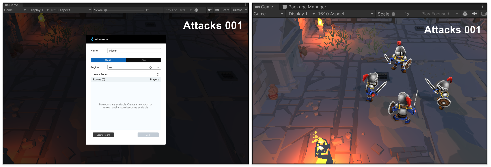

# Unity Project Template

This repo includes...
* Project Structure Best Practices from [SamuelAsherRivello/unity-project-template](https://github.com/SamuelAsherRivello/unity-project-template)
* C# Coding Standards for Unity from [SamuelAsherRivello/unity-project-template](https://github.com/SamuelAsherRivello/unity-project-template)
* Multiplayer from [Coherence.io](https://docs.coherence.io/get-started/install-coherence)
* Custom Demo Scenes

 

 

**Getting Started**
1. Download this repo (*.zip or *.git)
1. Download the [Unity Editor](https://store.unity.com/#plans-individual)
1. Create free account on [Coherence.io](https://docs.coherence.io/get-started/install-coherence)
1. Open this repo in the Unity Editor
1. Enjoy

 

Created By
=============

- Samuel Asher Rivello 
- Over 23 years XP with game development (2023)
- Over 10 years XP with Unity (2023)

Contact
=============

- Twitter - <a href="https://twitter.com/srivello/">@srivello</a>
- Resume & Portfolio - <a href="http://www.SamuelAsherRivello.com">SamuelAsherRivello.com</a>
- Git - <a href="https://github.com/SamuelAsherRivello/">Github.com/SamuelAsherRivello</a>
- LinkedIn - <a href="https://Linkedin.com/in/SamuelAsherRivello">Linkedin.com/in/SamuelAsherRivello</a> <--- Say Hello! :)

**License**

Provided as-is under <a href="./LICENSE">MIT License</a> | Copyright ™ & © 2006 - 2024 Rivello Multimedia Consulting, LLC

